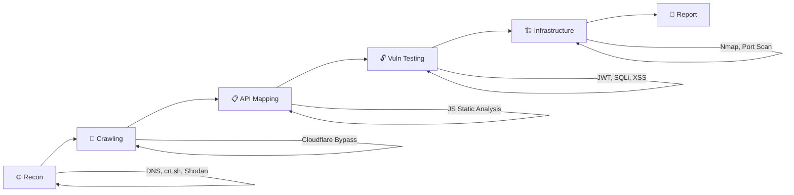

# 🔒 Security Research — Web Application Penetration Testing

<div align="center">


**Bộ công cụ và báo cáo bảo mật từ các dự án đánh giá bảo mật thực tế**

[Công Cụ](#-công-cụ) • [Phương Pháp](#-phương-pháp) • [Kết Quả](#-kết-quả-mẫu) • [Kỹ Năng](#-kỹ-năng)

</div>

---

## 📋 Tổng Quan

Repository này chứa các công cụ tự viết và báo cáo từ quá trình đánh giá bảo mật ứng dụng web. Tất cả nghiên cứu được thực hiện theo nguyên tắc **responsible disclosure** — các lỗ hổng đã được báo cáo cho nhà cung cấp trước khi công khai.

> ⚠️ **Disclaimer:** Các công cụ và kỹ thuật trong repo này chỉ dùng cho mục đích nghiên cứu bảo mật hợp pháp. Không sử dụng trái phép.

---

## 🛠️ Công Cụ

### Crawler & Recon

| Tool | Mô tả | Tech |
|------|--------|------|
| [`crawl_webapp.js`](tools/crawl_webapp.js) | Puppeteer crawler — bypass Cloudflare WAF, tải & phân tích JS bundles | Node.js, Puppeteer |
| [`recon_infrastructure.js`](tools/recon_infrastructure.js) | Subdomain enum, S3 bucket check, DNS recon, email enum | Node.js |
| [`bruteforce_paths.js`](tools/bruteforce_paths.js) | Hidden path discovery với concurrency control | Node.js |

### Vulnerability Testing

| Tool | Mô tả | Tech |
|------|--------|------|
| [`test_api_basic.js`](tools/test_api_basic.js) | API tester — IDOR, privilege escalation, info disclosure (60+ endpoints) | Node.js |
| [`test_api_advanced.js`](tools/test_api_advanced.js) | JWT attacks, SQLi, Stored XSS, Race conditions | Node.js |
| [`test_real_ip.js`](tools/test_real_ip.js) | Cloudflare bypass — test trực tiếp IP thật với Host header spoofing | Node.js |

---

## 🔍 Phương Pháp



### Phase 1: Reconnaissance
- DNS records (A, MX, TXT, NS) via Google DoH
- Certificate Transparency logs (crt.sh)
- Subdomain enumeration (70+ subdomains)
- Shodan/Censys IP intelligence

### Phase 2: Crawling & Analysis
- Puppeteer-based crawler with Cloudflare bypass
- JavaScript bundle download & static analysis
- API endpoint extraction from minified JS
- Authentication flow analysis

### Phase 3: Vulnerability Testing
- JWT manipulation (none algorithm, weak secrets, expiration bypass)
- SQL Injection (classic, time-based blind, union-based)
- Stored XSS via profile fields
- IDOR / Broken Access Control
- Race conditions
- Business logic flaws (payment, currency)
- Mass assignment testing

### Phase 4: Infrastructure Assessment
- Real IP discovery (SPF records, crt.sh, historical DNS)
- Port scanning (Nmap) on discovered IPs
- Service fingerprinting (MariaDB, SSH, MDaemon)
- Docker registry probing
- S3 bucket misconfiguration checks

---

## 📊 Kết Quả Mẫu

### Dự án: Cloud Hosting Provider Assessment

| Severity | Số lượng | Ví dụ |
|----------|----------|-------|
| 🔴 High | 4 | JWT expiration bypass, Database exposed, SSH exposed, Stored XSS |
| 🟡 Medium | 5 | User enumeration, API map disclosure, Docker registry leak, Dangling DNS |
| 🔵 Info | 9 | Version disclosure, SPF leak, Subdomain leak via crt.sh |
| ✅ Passed | 13 | JWT strong secret, SQLi blocked, Admin auth correct, Nuclei 0 CVE |

### Nổi bật:
- **JWT Expiration Bypass** — Token hết hạn 2 ngày vẫn được API chấp nhận
- **Database Exposed** — MariaDB 10.6.23 mở port 3306 ra internet trên staging server
- **110+ Subdomains** phát hiện qua Certificate Transparency logs
- **3 Real IPs** tìm được đằng sau Cloudflare
- **100+ API Endpoints** extracted từ minified JavaScript

---

## 🧰 Kỹ Năng

### Tools & Platforms
```
Kali Linux    │  Nmap         │  Hydra        │  Shodan
Burp Suite    │  Nuclei       │  SQLMap       │  ffuf
Puppeteer     │  Node.js      │  crt.sh       │  Google DoH
```

### Techniques
```
Cloudflare Bypass     │  JWT Attacks           │  API Fuzzing
DNS Recon             │  Port Scanning         │  IDOR Testing
Static JS Analysis    │  Certificate Recon     │  Docker Registry Probing
Subdomain Takeover    │  SPF/MX IP Leaks       │  Brute Force (controlled)
```

### Frameworks & Standards
```
OWASP Top 10    │  PTES    │  Responsible Disclosure
```

---

## 📁 Cấu Trúc Repo

```
security-research/
├── README.md
├── tools/                          # Các công cụ tự viết
│   ├── crawl_webapp.js             # Cloudflare bypass crawler
│   ├── test_api_basic.js           # Basic API vulnerability tester
│   ├── test_api_advanced.js        # Advanced vuln testing (JWT, SQLi, XSS)
│   ├── recon_infrastructure.js     # Infrastructure recon
│   ├── bruteforce_paths.js         # Hidden path discovery
│   ├── test_real_ip.js             # Direct IP testing
│   └── wordlist_paths.txt          # Custom wordlist
├── reports/                        # Báo cáo mẫu (đã sanitize)
│   └── sample_disclosure.md        # Responsible disclosure template
└── methodology/                    # Tài liệu phương pháp
    └── web_app_pentest_checklist.md
```

---

## ⚖️ Đạo Đức & Pháp Lý

- ✅ Tất cả testing được thực hiện với **thiện chí**
- ✅ Lỗ hổng được báo cáo theo **responsible disclosure**
- ✅ Không dữ liệu nào bị trích xuất hoặc chia sẻ
- ✅ Không gây gián đoạn dịch vụ
- ✅ Thông tin nhạy cảm đã được **sanitize** trước khi công khai

---

## 📬 Liên Hệ

- **GitHub:** [@thanledinh](https://github.com/thanledinh)
- **Email:** [Email của bạn]

---

<div align="center">

**Made with 🔥 by thanledinh**

</div>
